# 业务需求分析
## 需求调查
### 1. 背景
近年来随着信息技术的进步，Blog（音译博客）也快速发展。为人们提供了一个自由、开放、互动的交流平台。博客不仅可以帮助个人实现自我表达和展示，也可以为企业、政府、媒体等机构提供一个有效的宣传和传播渠道。沟通方式比电子邮件、讨论群组以及BBS和论坛更展现个性，博客系统已经成为广大用户发表文章言论的主要工具，同时，博客也为网络营销、个人品牌建设、知识分享等方面提供了有力的支持。
### 2. 业务机遇
内容创作：博客本身就是以内容为核心的平台，因此，对于擅长写作的人来说，博客提供了一个很好的机会来展示自己的才华和技能。通过不断更新高质量、有价值的内容，博客可以吸引更多的读者，进而获得更多的关注和流量。

营销推广：博客可以作为一个宣传和推广产品或服务的平台，通过博客上的内容来吸引潜在客户的注意，提高品牌知名度和产品销售。

广告收入：博客也可以通过在内容中嵌入广告或推广合作，获得广告收入。例如，博主可以通过展示谷歌广告或加入广告联盟等方式来获得广告收入。

会员订阅：博主可以通过提供独家内容、优惠福利、专业服务等方式来吸引粉丝成为会员，从而获得稳定的收入。

品牌合作：博主可以通过与品牌进行合作，为品牌提供曝光和宣传，从而获得一定的收益。
### 3. 业务目标
提高网站流量：通过优化博客的SEO，定期发布高质量、有价值的内容，积极推广博客，吸引更多的访问者，提高网站流量。

提高用户留存率：通过提供个性化的用户体验，例如定期推送订阅邮件、社交媒体分享等方式，增强用户的参与感和忠诚度，提高用户留存率。

增加粉丝数量：通过各种社交媒体平台和其他渠道宣传博客，积极与读者互动，增加粉丝数量。可以通过提供独家内容、优惠福利等方式吸引更多的用户成为粉丝。

扩大品牌影响力：通过与其他博主、品牌进行合作，参与各种行业活动和社区活动，扩大博客的品牌影响力。

增加收益：通过各种方式如会员订阅、广告收入、品牌合作等，增加博客的收益。可以通过谷歌广告等广告平台、知名电商平台等方式，获取更多的收益。

### 4. 成功指标
网站流量：通过谷歌分析等工具，统计网站的访问量、访问来源、访问时长、访问页面等数据，分析网站的流量情况。

### 5. 愿景陈述
博客应具有积极的社会意义和价值，提供一个平台为读者提供有用的信息和知识，或者帮助读者解决实际问题等。也可以成为特定领域的权威博客，或者成为特定群体的首选博客等。博客的受众是博客的目标读者群体，博客的影响范围则是博客所影响的人群和领域。做到全国第一的博客

### 6. 业务风险
博客的内容可能存在侵权、虚假宣传、违反社会公德等问题，导致法律风险和声誉风险。

博客的流量可能受到搜索引擎算法变化、社交媒体政策调整等因素的影响，导致流量的急剧下降。

博客所在的行业和领域可能存在激烈的竞争，其他博客可能通过价格战、品牌宣传等手段抢占市场份额。

博客所处的政策环境可能发生变化，例如出台新的网络安全法规、版权法规等，导致博客需要承担额外的合规成本和责任。

### 7. 业务假设和依赖
系统为用户们提供了个性化的用户界面，用户可以根据个性需求装扮界面。

服务器可以承受上千人的访问量，并且检测博客是否合规并上传的时间控制在30分钟以内。

## 软件需求规范

### 1. 目的

基于个人博客的特点，本系统实现个人博客的主要功能，包括博客系统的站主登录/退出，博客站主并发表文章、图片等，游客发表评论、分页浏览文章和下载文章附件等。博客系统主要区分了两类用户，分别为博客站主和普通游客。网站登录仅限于博客站主，博客站主可以登陆写下自己的文章与上传附件，登陆即拥有网站管理的权限，未登录时均以游客身份访问。游客主要的功能是分页、分类、分标签阅读博客站主文章和浏览图片，发表评论和留言。

### 2. 项目范围

个人博客将提供一个网站给站主写博客，为游客提供阅读，下载附件，评论的功能

### 3. 用户类别及特征

| 用户类别 | 描述              |
|------|-----------------|
| 游客   | 查看，转发，评论站主发布的文章 |
| 站主   | 添加，修改，删除文章，维护网站 |

### 4. 假设与依赖

- 站主的服务器有充足的容量存储数据
- 站主的服务器运行正常

## 用例

个人博客网站的主要操作者及用例

| 主要操作者 | 用例                                                              |
|-------|-----------------------------------------------------------------|
|  游客   |  1.浏览文章 2.评论文章 3.下载附件                                     |
|  站主   |  1.登录 2.注销 3.发表文章 4.修改文章 5.删除文章 6.上传附件 7.删除附件 |

### 1. 发表文章

| 用例名称   | 发表文章                                                                                                    |
|--------|---------------------------------------------------------------------------------------------------------|
|  参与者   |  站主                                                                                                     |
|  前置条件  |  站主必须登录                                                                                                 |
|  后置条件  |  文章发表成功                                                                                                 |
|  主事件流  |  1.站主点击发表文章按钮 2.站主填写文章信息 3.系统保存文章信息 4.系统提示发表成功                                              |
|  备选事件流 |  3a.系统检测到文章信息有误 3a1.系统提示文章信息有误 3a2.系统返回文章填写页面 3a3.站主修改文章信息 3a4.系统保存文章信息 3a5.系统提示发表成功  |

### 2. 上传附件

| 用例名称   | 上传附件                                                                                                    |
|--------|---------------------------------------------------------------------------------------------------------|
|  参与者   |  站主                                                                                                     |
|  前置条件  |  站主必须登录                                                                                                 |
|  后置条件  |  附件上传成功                                                                                                 |
|  主事件流  |  1.站主点击上传附件按钮 2.站主选择附件 3.系统保存附件信息 4.系统提示上传成功                                                |
|  备选事件流 |  3a.系统检测到附件信息有误 3a1.系统提示附件信息有误 3a2.系统返回附件填写页面 3a3.站主修改附件信息 3a4.系统保存附件信息 3a5.系统提示上传成功  |

### 3. 发表评论

| 用例名称   | 发表评论                                                                                                    |
|--------|---------------------------------------------------------------------------------------------------------|
|  参与者   |  游客                                                                                                     |
|  前置条件  |  无                                                                                                      |
|  后置条件  |  评论发表成功                                                                                                 |
|  主事件流  |  1.游客点击发表评论按钮 2.游客填写评论信息 3.系统保存评论信息 4.系统提示发表成功                                              |
|  备选事件流 |  3a.系统检测到评论信息有误 3a1.系统提示评论信息有误 3a2.系统返回评论填写页面 3a3.游客修改评论信息 3a4.系统保存评论信息 3a5.系统提示发表成功  |

### 4. 发表留言

| 用例名称   | 发表留言                                                                                                    |
|--------|---------------------------------------------------------------------------------------------------------|
|  参与者   |  游客                                                                                                     |
|  前置条件  |  无                                                                                                      |
|  后置条件  |  留言发表成功                                                                                                 |
|  主事件流  |  1.游客点击发表留言按钮 2.游客填写留言信息 3.系统保存留言信息 4.系统提示发表成功                                              |
|  备选事件流 |  3a.系统检测到留言信息有误 3a1.系统提示留言信息有误 3a2.系统返回留言填写页面 3a3.游客修改留言信息 3a4.系统保存留言信息 3a5.系统提示发表成功  |

### 5. 登录

| 用例名称   | 登录                                                                                                      |
|--------|---------------------------------------------------------------------------------------------------------|
|  参与者   |  站主                                                                                                     |
|  前置条件  |  无                                                                                                      |
|  后置条件  |  登录成功                                                                                                   |
|  主事件流  |  1.站主点击登录按钮 2.站主填写登录信息 3.系统保存登录信息 4.系统提示登录成功                                                |
|  备选事件流 |  3a.系统检测到登录信息有误 3a1.系统提示登录信息有误 3a2.系统返回登录填写页面 3a3.站主修改登录信息 3a4.系统保存登录信息 3a5.系统提示登录成功  |

### 6. 注销

| 用例名称  | 注销                            |
|-------|-------------------------------|
|  参与者  |  站主                           |
|  前置条件 |  站主必须登录                       |
|  后置条件 |  注销成功                         |
|  主事件流 |  1.站主点击注销按钮 2.系统提示注销成功  |

### 7. 修改文章

| 用例名称   | 修改文章                                                                                                    |
|--------|---------------------------------------------------------------------------------------------------------|
|  参与者   |  站主                                                                                                     |
|  前置条件  |  站主必须登录                                                                                                 |
|  后置条件  |  文章修改成功                                                                                                 |
|  主事件流  |  1.站主点击修改文章按钮 2.站主修改文章信息 3.系统保存文章信息 4.系统提示修改成功                                              |
|  备选事件流 |  3a.系统检测到文章信息有误 3a1.系统提示文章信息有误 3a2.系统返回文章填写页面 3a3.站主修改文章信息 3a4.系统保存文章信息 3a5.系统提示修改成功  |

### 8. 删除文章

| 用例名称  | 删除文章                            |
|-------|---------------------------------|
|  参与者  |  站主                             |
|  前置条件 |  站主必须登录                         |
|  后置条件 |  文章删除成功                         |
|  主事件流 |  1.站主点击删除文章按钮 2.系统提示删除成功  |

### 9. 查看统计信息
| 用例名称  | 查看统计信息                            |
|-------|-----------------------------------|
|  参与者  | 站主                                |
|  前置条件 | 站主必须登录                            |
|  主事件流 | 1.站主登录后台页面 2.显示统计信息，包括来访者，来访ip |

| 用例优先级 | 用例                                                |
|-------|---------------------------------------------------|
|  高    |  1.发表文章 2.登录                                   |
|  中    |  1.上传附件 2.发表评论 3.发表留言 4.注销 5.修改文章  |
|  低    |  1.删除文章                                           |

# 项目可行性分析

## 经济可行性
*TODO*
## 技术可行性
*TODO*

# 项目设计

## 概要设计

将项目分成前端和后端两个部分，前端负责展示页面，后端负责处理数据。

### 前端

前端使用 Vue.js 框架，使用 Element UI 组件库，使用 axios 库进行数据请求。

### 后端

后端使用 Spring Boot 框架，使用 MyBatis 框架进行数据库操作。

### 组织结构图



## 详细设计

### 类图

- 附件实体类

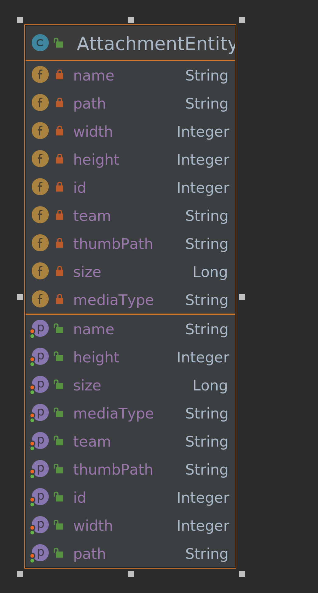

- 文章实体类

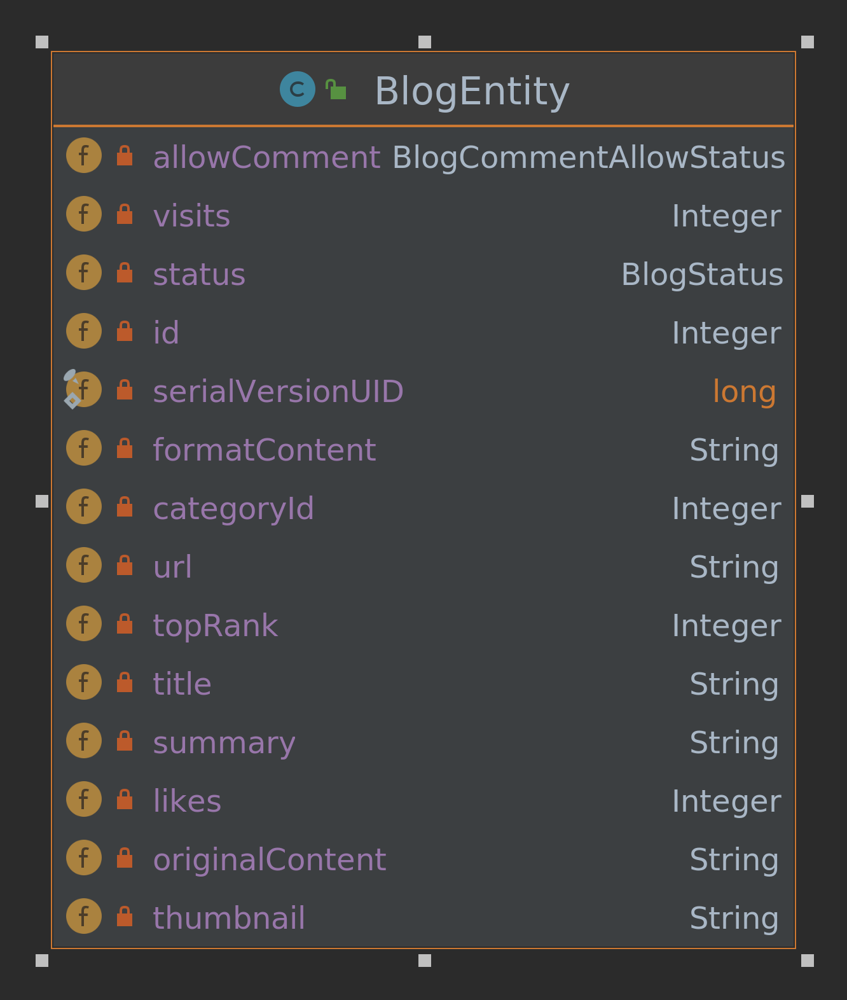

- 分类实体类

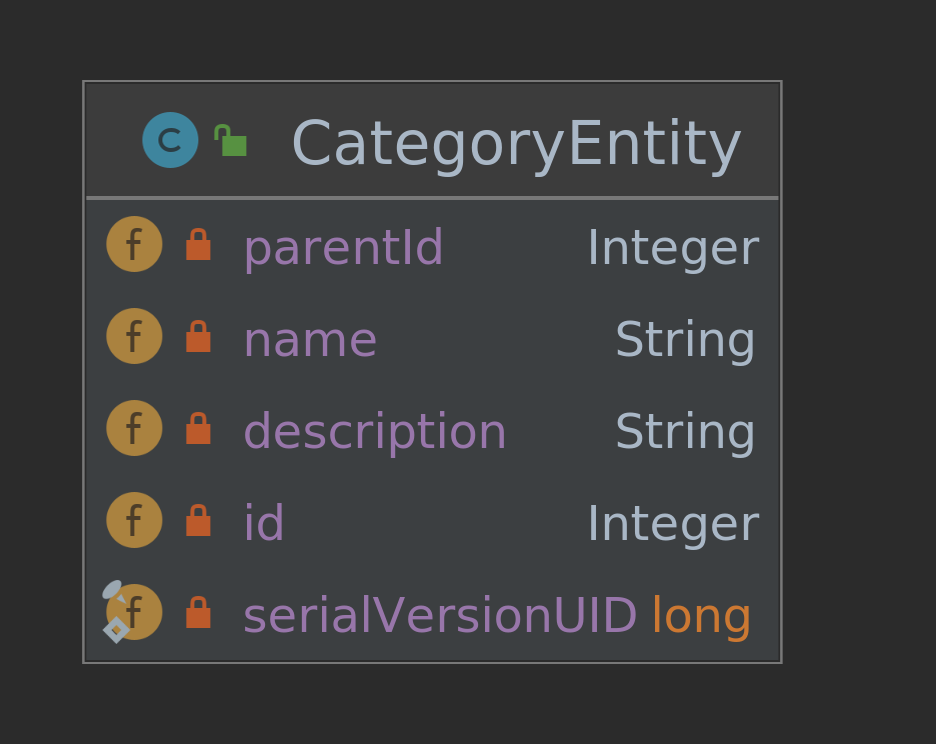

- 评论实体类

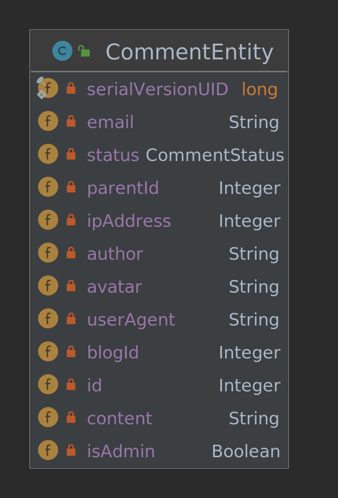

- 日志实体类

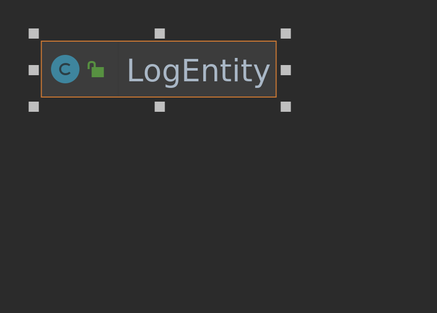

- 文章标签类

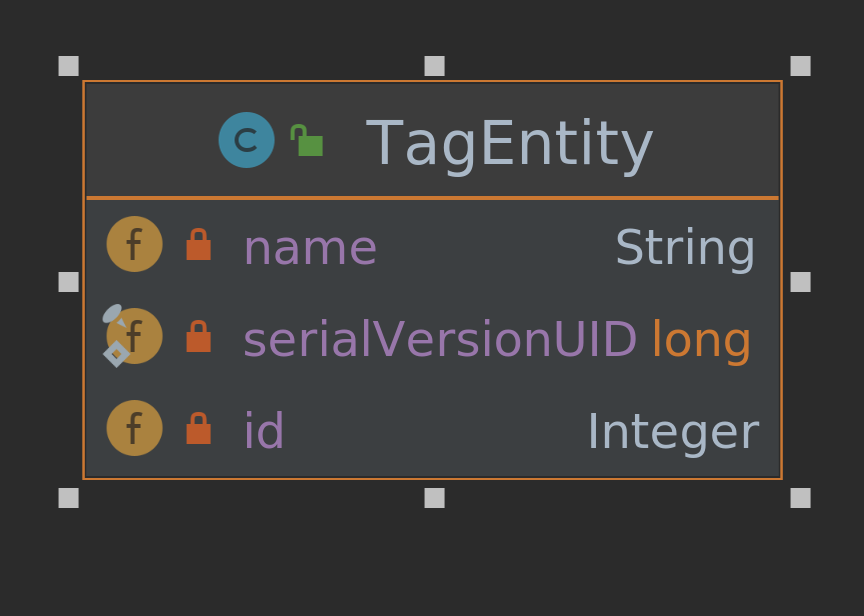

- 用户实体类

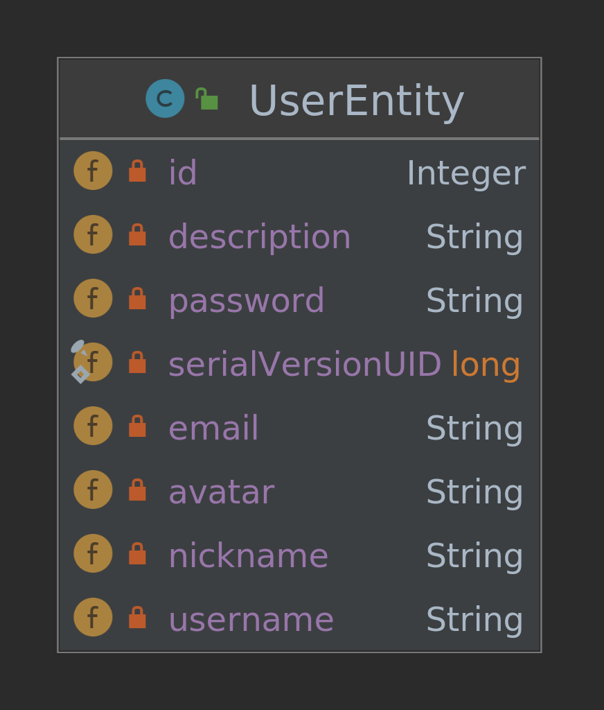

- 文章标签连结类

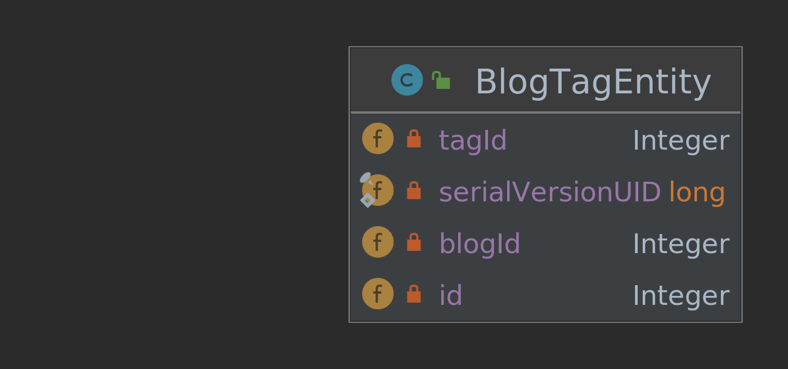

- 标签实体类

- 统计信息类

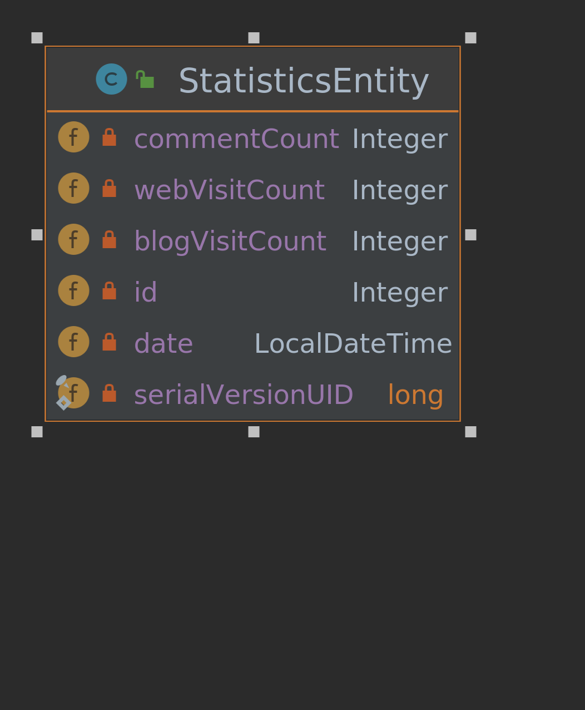

### 活动图

- 访客活动图



- 站主活动图



# 项目实现

## 后端实现
*TODO*

## 数据库设计

### 1. ER图

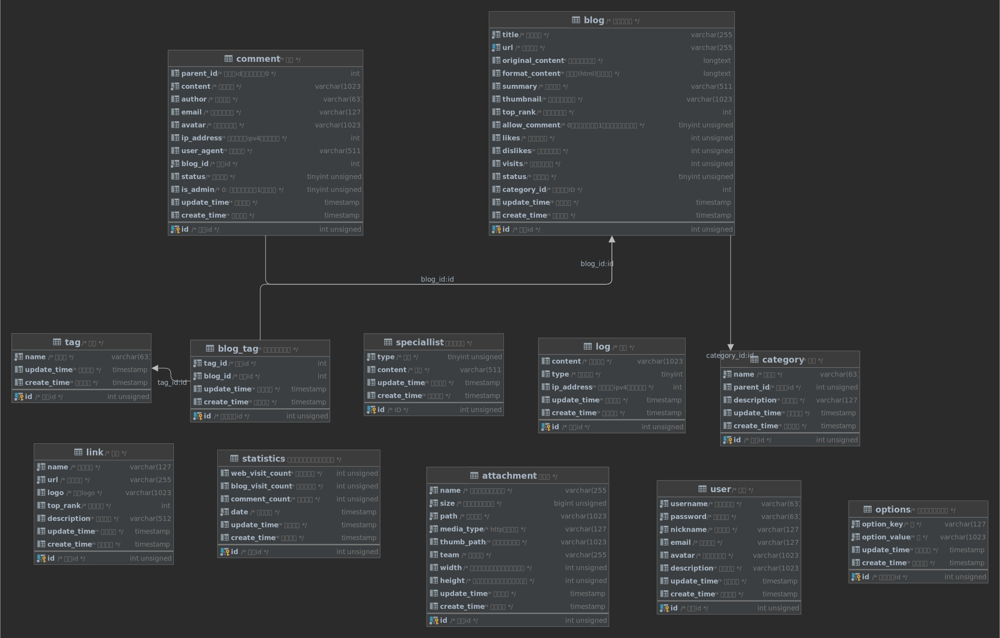

### 2. 数据流图

### 3. 数据库表

数据库名：`myblogdb`，数据库统一编码：`utf8mb4`

本项目共设计了 11个表，分别是：user(用户表)、blog(文章表)、category(分类表)、tag(标签表)、blog_tag(文章标签关联表)、comment(评论表)、attachment(附件表)、link(友链表)、options(系统选项/设置表)、log(日志表)和statistics(数据统计表)，具体设计如下：

**user : 用户表**

|     字段      |        类型        |    约束    |  说明  |
|:-----------:|:----------------:|:--------:|:----:|
|     id      | int(11) unsigned |    主键    | 用户id |
|  username   |   varchar(63)    | not null | 用户名  |
|  password   |   varchar(255)   | not null |  密码  |
|  nickname   |   varchar(127)   |          |  昵称  |
|    email    |   varchar(127)   |          |  邮箱  |
|   avatar    |  varchar(1023)   |          | 头像链接 |
| description |  varchar(1023)   |          | 个人描述 |
| update_time |    timestamp     |          | 更新时间 |
| create_time |    timestamp     |          | 创建时间 |

**blog : 博客文章表**

可以将 original_content 和 format_content 抽离出一张表。

|        字段        |         类型          |    约束    |        说明         |
|:----------------:|:-------------------:|:--------:|:-----------------:|
|        id        |  int(11) unsigned   |    主键    |       博客id        |
|      title       |    varchar(255)     | not null |       文章标题        |
| original_content |      longtext       |          | 原格式(markdown)文章内容 |
|  format_content  |      longtext       |          |   格式化(html)文章内容   |
|       url        |    varchar(255)     |          |      文章访问链接       |
|     summary      |    varchar(511)     |          |       文章摘要        |
|    thumbnail     |    varchar(1023)    |          |      文章缩略图链接      |
|     top_rank     |       int(11)       |          |      文章置顶排行       |
|  allow_comment   | tinyint(4) unsigned |          | 0: 不允许; 1: 允许(默认) |
|      likes       |  int(11) unsigned   |          |       点赞的人数       |
|      visits      |  int(11) unsigned   |          |       访问人数        |
|      status      | tinyint(4) unsigned |          |       文章状态        |
|   update_time    |      timestamp      |          |       更新时间        |
|   create_time    |      timestamp      |          |       创建时间        |

**category : 博客分类表**

|     字段      |        类型        |    约束    |     说明      |
|:-----------:|:----------------:|:--------:|:-----------:|
|     id      | int(11) unsigned |    主键    |    分类id     |
|    name     |   varchar(63)    | not null |     分类名     |
|  parent_id  | int(11) unsigned |          | 父分类id，0顶层分类 |
| description |   varchar(127)   |          |    分类描述     |
| update_time |    timestamp     |          |    更新时间     |
| create_time |    timestamp     |          |    创建时间     |

**tag : 博客标签表**

|     字段      |        类型        |    约束    |  说明  |
|:-----------:|:----------------:|:--------:|:----:|
|     id      | int(11) unsigned |    主键    | 标签id |
|    name     |   varchar(63)    | not null | 标签名  |
| update_time |    timestamp     |          | 更新时间 |
| create_time |    timestamp     |          | 创建时间 |

**blog_tag : 博客标签关联表**

|     字段      |        类型        |    约束    |   说明   |
|:-----------:|:----------------:|:--------:|:------:|
|     id      | int(11) unsigned |    主键    | 博客标签id |
|   tag_id    | int(11) unsigned | not null |  标签id  |
|   blog_id   | int(11) unsigned | not null |  博客id  |
| update_time |    timestamp     |          |  更新时间  |
| create_time |    timestamp     |          |  创建时间  |

**comment : 博客评论表**

|     字段      |         类型          |    约束    |        说明         |
|:-----------:|:-------------------:|:--------:|:-----------------:|
|     id      |  int(11) unsigned   |    主键    |       评论id        |
|  parent_id  |  int(11) unsigned   |          |  父评论id，0顶层评论，默认0  |
|   content   |    varchar(1023)    | not null |       评论内容        |
|   author    |     varchar(64)     | not null |       评论作者        |
|    email    |    varchar(127)     | not null |      评论作者邮箱       |
|   avatar    |    varchar(1023)    |          |      评论作者头像       |
| ip_address  |       int(11)       |          |  评论作者的IPv4地址，整型   |
| user_agent  |    varchar(511)     |          |     评论作者的用户代理     |
|   blog_id   |  int(11) unsigned   | not null |       博客id        |
|   status    | tinyint(4) unsigned |          |       评论状态        |
|  is_admin   | tinyint(4) unsigned |          | 0: 访客(默认); 1: 管理员 |
| update_time |      timestamp      |          |       更新时间        |
| create_time |      timestamp      |          |       创建时间        |

**attachment  : 附件表**

|     字段      |        类型        |    约束    |       说明       |
|:-----------:|:----------------:|:--------:|:--------------:|
|     id      | int(11) unsigned |    主键    |      文件id      |
|    name     |   varchar(255)   | not null |      文件名       |
|    size     | int(11) unsigned | not null |    文件大小（字节）    |
|    path     |  varchar(1023)   | not null |      文件路径      |
| media_type  |   varchar(127)   | not null |    互联网媒体类型     |
| thumb_path  |  varchar(1023)   |          |    文件缩略图路径     |
|    width    | int(11) unsigned |          | 文件为图片时，图片的宽度像素 |
|   height    | int(11) unsigned |          | 文件为图片时，图片的高度像素 |
| update_time |    timestamp     |          |      更新时间      |
| create_time |    timestamp     |          |      创建时间      |

**link : 友链表**

|     字段      |        类型        |    约束    |   说明   |
|:-----------:|:----------------:|:--------:|:------:|
|     id      | int(11) unsigned |    主键    |  友链id  |
|    name     |   varchar(127)   | not null |  友链名称  |
|     url     |   varchar(255)   | not null |  友链链接  |
|    logo     |  varchar(1023)   |          | 友链logo |
|  top_rank   |     int(11)      |          |  友链排行  |
| description |   varchar(255)   |          |  友链描述  |
| update_time |    timestamp     |          |  更新时间  |
| create_time |    timestamp     |          |  创建时间  |

**options : 系统设置**

|      字段      |        类型        |    约束    |   说明   |
|:------------:|:----------------:|:--------:|:------:|
|      id      | int(11) unsigned |    主键    | 系统设置id |
|  option_key  |   varchar(127)   | not null |   键    |
| option_value |  varchar(1023)   | not null |   值    |
| update_time  |    timestamp     |          |  更新时间  |
| create_time  |    timestamp     |          |  创建时间  |

**log : 日志表**

|     字段      |         类型          | 约束  |      说明       |
|:-----------:|:-------------------:|:---:|:-------------:|
|     id      |  int(11) unsigned   | 主键  |     日志id      |
|   content   |    varchar(1023)    |     |     操作内容      |
|    type     | tinyint(4) unsigned |     |     操作类型      |
| ip_address  |       int(11)       |     | 操作人的ipv4地址，整型 |
| update_time |      timestamp      |     |     更新时间      |
| create_time |      timestamp      |     |     创建时间      |

**statistics : 统计表（统计每日的数据）**

|        字段        |        类型        |    约束    |  说明   |
|:----------------:|:----------------:|:--------:|:-----:|
|        id        | int(11) unsigned |    主键    | 统计id  |
| web_visit_count  | int(11) unsigned |          | 网站访问量 |
| blog_visit_count | int(11) unsigned |          | 文章访问量 |
|  comment_count   | int(11) unsigned |          | 评论数量  |
|       date       |    timestamp     | not null | 统计日期  |
|   update_time    |    timestamp     |          | 更新时间  |
|   create_time    |    timestamp     |          | 创建时间  |

**specialist : 特殊清单**

|     字段      |         类型          | 约束  |  说明  |
|:-----------:|:-------------------:|:---:|:----:|
|     id      |  int(11) unsigned   | 主键  |  ID  |
|    type     | tinyint(4) unsigned |     |  类型  |
|   content   |    varchar(511)     |     |  内容  |
| update_time |      timestamp      |     | 更新时间 |
| create_time |      timestamp      |     | 创建时间 |

## 前端实现

### 后台管理实现

#### 1. 参考[Halo](https://www.halo.run/)

Halo是一个建站工具，提供了一系列的组件，可以快速搭建一个博客网站。

#### 2. 设计后台的整体页面，设计边栏，顶栏，主体

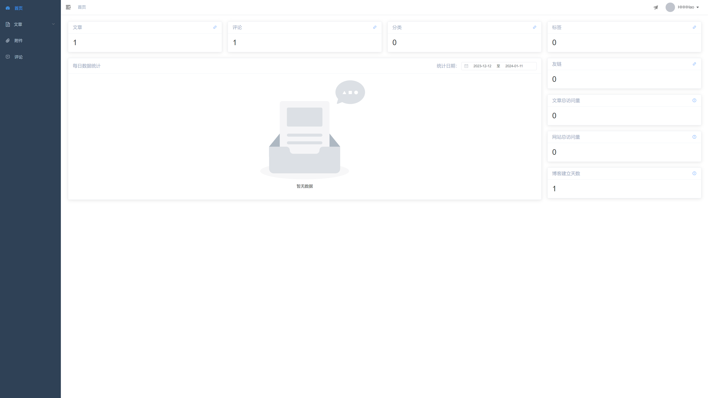

#### 3. 设计文章页面，调用api对文章进行上传，修改，查看，删除

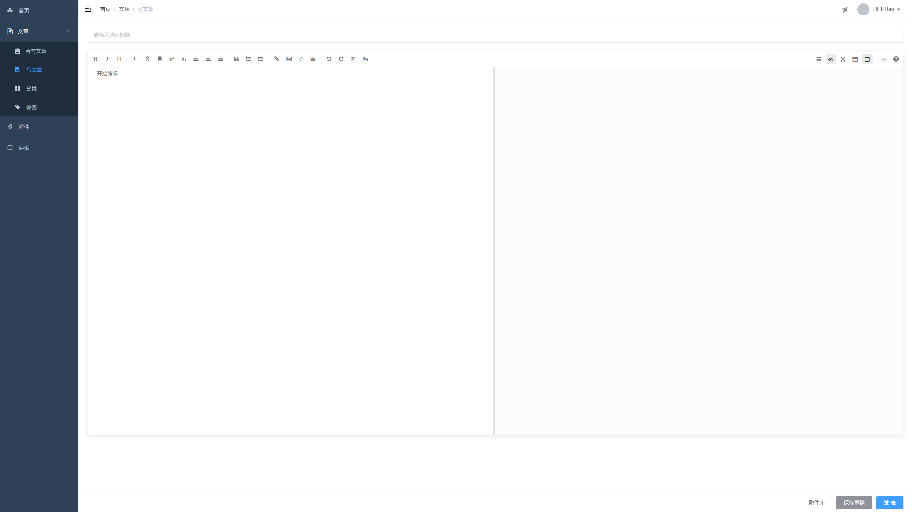

#### 4. 设计评论页面，调用api对评论进行查看，删除，回复

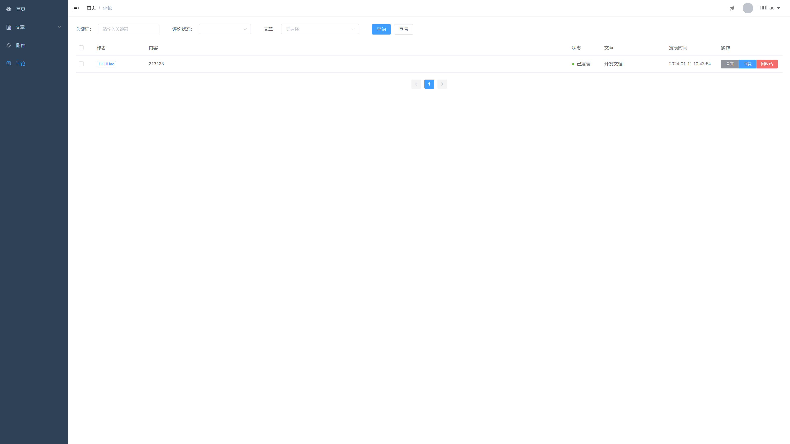

#### 5. 设计附件页面，可以对附件进行上传，删除

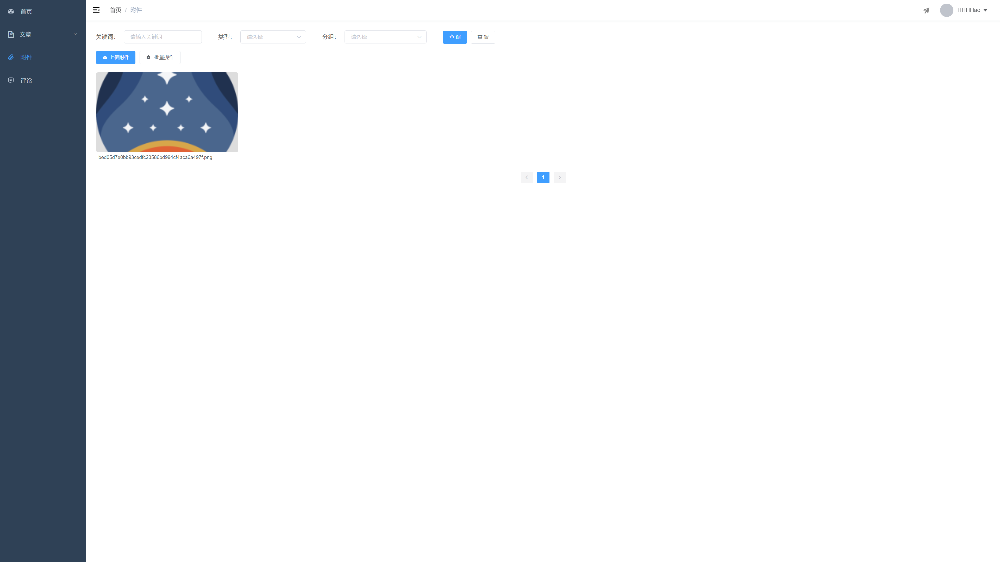

#### 6. 设计登录页面，调用api对登录进行验证，登录成功后跳转到后台管理页面

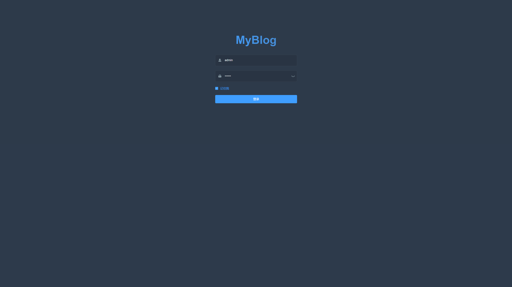

### 前台实现

#### 1. 设计前台的整体页面，设计边栏，顶栏，主体

其中背景图片是随机调用公共接口获取的

#### 2. 设计文章查看页面

后端会对文章的内容进行格式化，从markdown格式转换成html格式传递给前端，前端接收数据后插入到内容区，进行渲染

#### 3. 设计评论区，调用api对评论进行查看，回复

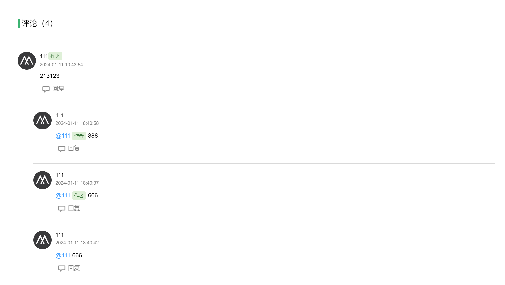

评论的时候会将内容和作者的信息传递给后端，后端接收到数据后进行处理，将数据存储到数据库中，前端会调用api获取评论的数据，然后将数据渲染到评论区

评论的回复会添加到评论的下方，并且表明父评论的id，后端返回具有树形结构的数据，前端会对数据进行处理，将数据渲染到评论区

#### 4. 设计归档页面，调用api获取所有文章的数据，按照时间进行归档

#### 5. 设计搜索框，调用api对文章进行搜索，返回搜索结果并重新对主页进行渲染

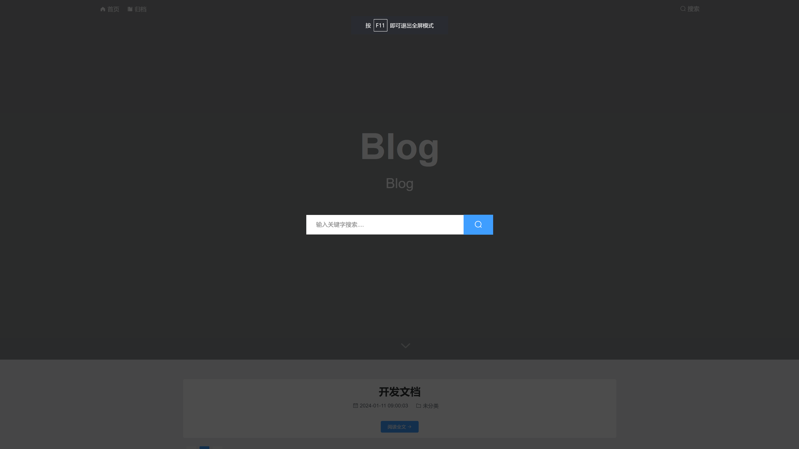

在后端的api中，会对搜索的关键字进行处理，将关键字传递给数据库，数据库会返回包含关键字的文章，如果不传入关键字，数据库会返回所有文章，前端接收到数据后，会对数据进行处理，将数据渲染到主页

# 项目分工

| 姓名  |     学号      |   分工    |
|:---:|:-----------:|:-------:|
| 曾荣豪 | 20212005343 | 前端实现，项目文档 |

